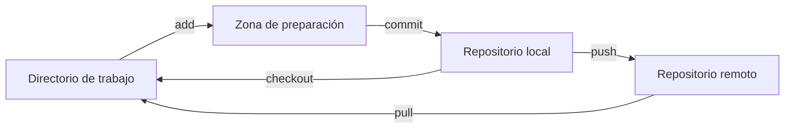

# [GIT](https://git-scm.com/)

# Instalación

Instalar última versión estable
En windows agregar a path
Instalar con configuraciones predeterminadas si se está iniciando.

# Bash

Abrir desde explorador de archivos.
O abrir aplicación y navegar al directorio.
Es donde se ejecutarán los comandos GIT.

## Configuración

`git config --list`

```bash
git config --global user.name "nombre_usuario"
git config --global user.email correo@ejemplo.com 
```

## Comandos principales

### Status

`git status`

### Pull

`git pull`: Combinación de fetch y merge.

### Add

`git add -A`

### Commit

`git commit -m "Mensaje del commit"`

### Push

`git push`

### Merge

Fusiona lo repositorio local y remoto. Se pueden dar conflictos, o "Merge conflicts"

#### Merge conflicts

Cuando hay diferencias en las mismas lineas de un archivo en los repositorios local y remoto.

### Branch

`git branch`
`git checkout`

Ramas para la organización de proyectos, y trabajos colaborativos. 

## Ramas / Branches

Partes independientes de los proyectos, donde se puede desarrollar nuevos elementos del proyecto para su posterior publicaación.

## Flujo de trabajo

Zona de preparación = Staging area

