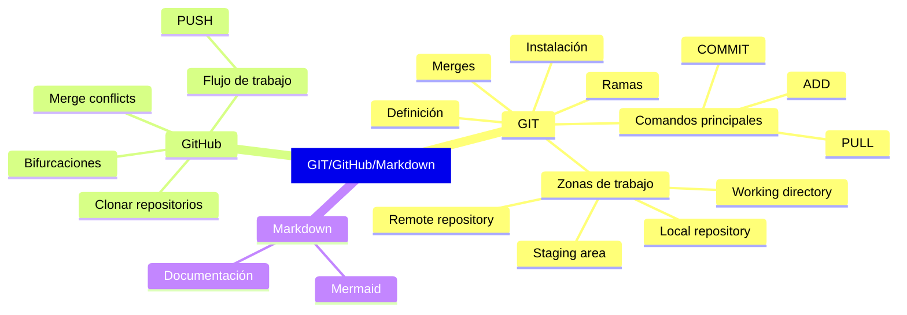

# GIT-GitHub-Markdown

Repositorio para recursos de uso de GIT, GitHub y Markdown.
IDE para muestras: [Visual Studio Code](https://code.visualstudio.com/)

- [GIT-GitHub-Markdown](#git-github-markdown)
- [Estructura](#estructura)
- [Recursos extra](#recursos-extra)

# Estructura

1. [Sistema de control de versiones](https://github.com/git/git/commit/e83c5163316f89bfbde7d9ab23ca2e25604af290#diff-2b7814d3fca2e99e56c51b6ff2aa313ea6e9da6424804240aa8ad891fdfe0900)
2. Repositorio local
3. Repositorio remoto
4. Flujo de trabajo
5. Documentación
6) Buenas prácticas

# Recursos extra

- Herramienta Mermaid
- Comando `amend`
- Escribir un [Changelog](https://keepachangelog.com/en/1.1.0/)
- Extensiones para VSCode:
  - Conventional Commits
  - Markdown All in One
  - Mermaid